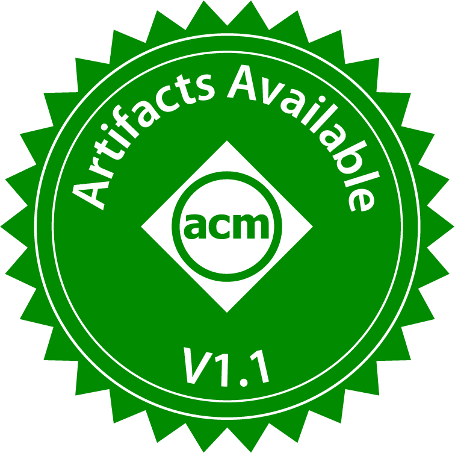
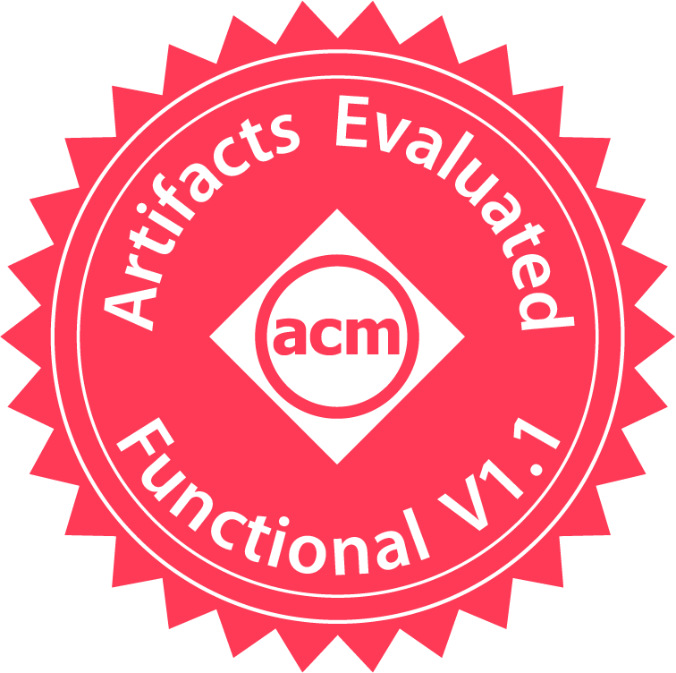
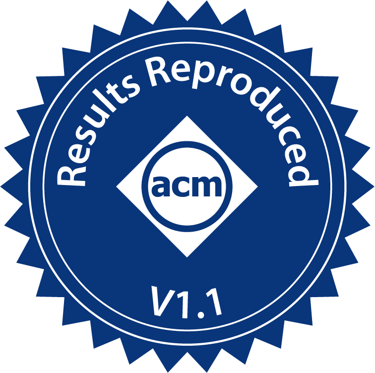
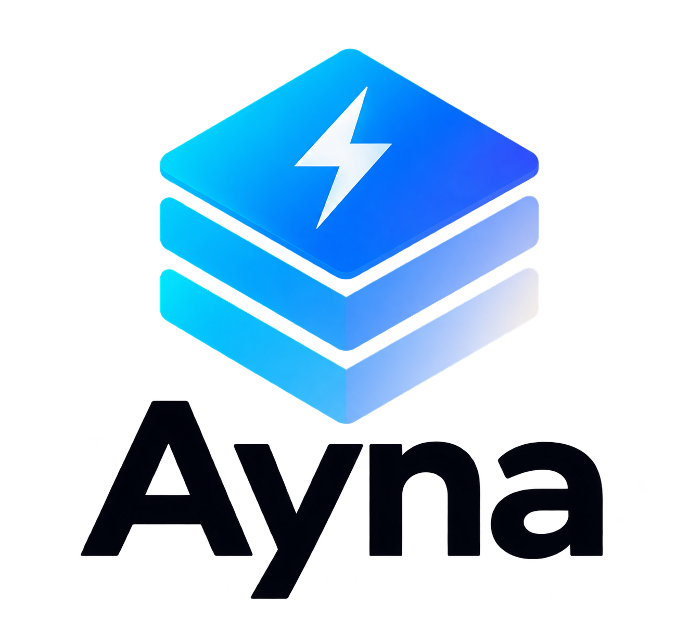
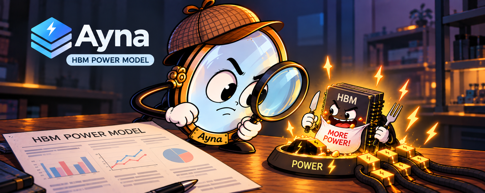

<table align="center">
  <tr>
    <td align="center"></td>
    <td align="center"></td>
    <td align="center"></td>
  </tr>
</table>

<p align="center">
  
</p>

<h1 align="center">Ayna: An Accurate High Bandwidth Memory Power Model</h1>

<!-- TODO: replace XXXX.XXXXX with the arXiv ID -->
<p align="center">
  <a href="https://arxiv.org/abs/XXXX.XXXXX"></a>
  
  <a href="https://doi.org/10.5281/zenodo.21531486"></a>
  <a href="LICENSE"></a>
</p>

Ayna is a trace-driven power model for High Bandwidth Memory (HBM) that captures
both structural and data-pattern-dependent power variation and is substantially
more accurate than state-of-the-art HBM power models. 

Ayna is based on [DRAMPower](https://github.com/tukl-msd/DRAMPower). We make the
following changes to the baseline DRAMPower model: 1) add HBM2/3/4 organization
and command timing specifications, 2) implement the IDD values obtained from our
characterization study, 3) extend the model to capture structural power
variation across bank groups and banks in the HBM2 chip, and 4) we extend the
model to capture data pattern dependence of power. See [docs/reference/changes-from-drampower.md](docs/reference/changes-from-drampower.md) for more details.

Given a memory organization, a timing configuration, a set of IDD currents and a
DRAM command trace, Ayna reports the energy and average power of that trace.
This repository also contains four case studies that reproduce the modeling
results of our MICRO 2026 paper: validation against measured HBM2 and HBM3E
power, data-pattern-dependent power modeling, and HBM4 read energy estimation.


- Extended version of our paper on arXiv: Link TBD
- Characterization data and artifacts: <https://github.com/CMU-SAFARI/HBM-Power/tree/artifact>
  (officially artifact evaluated as available, functional, and reproduced)

## Cite Ayna

Please cite the following paper if you use Ayna:

> Ataberk Olgun, Spiros Galanopoulos, Andreas Kosmas Kakolyris, Haocong Luo,
> İsmail Emir Yüksel, F. Nisa Bostancı, and Onur Mutlu, "Understanding the Power
> Consumption of Modern High Bandwidth Memory: Experimental Analysis and Modeling
> Using Real HBM2 DRAM Chips," in *Proceedings of the 59th IEEE/ACM International
> Symposium on Microarchitecture (MICRO)*, 2026.

### BibTeX Entry 

```bibtex
@inproceedings{olgun2026understanding,
  author    = {Olgun, Ataberk and Galanopoulos, Spiros and Kakolyris, Andreas Kosmas and
               Luo, Haocong and Y{\"u}ksel, {\.I}smail Emir and Bostanc{\i}, F. Nisa and
               Mutlu, Onur},
  title     = {{Understanding the Power Consumption of Modern High Bandwidth Memory:
               Experimental Analysis and Modeling Using Real HBM2 DRAM Chips}},
  booktitle = {MICRO},
  year      = {2026}
}
```

## Quick Start

You need CMake 3.22 or later, a C++17 compiler, and network access on the
first configure (CMake fetches nlohmann_json, DRAMUtils, CLI11 and spdlog).

```bash
git clone https://github.com/CMU-SAFARI/HBM-Power
cd HBM-Power

cmake --preset release
cmake --build --preset release -j

# Generate a read trace for one HBM2 pseudo-channel and estimate its power
C=config/HBM2_1200MTs
python3 examples/make_read_trace.py $C --refresh -o read.csv
./build/bin/HBM2_runner $C/organization.json $C/timing.json $C/power.json read.csv
# ...
# Average power: 422.056 mW
```

The [getting-started tutorial](docs/tutorials/getting-started.md) walks through
each step and explains the output. To regenerate every case-study figure,
install the Python dependencies (`pip install -r requirements.txt`) and run
`./run_all.sh`.

## Documentation

The documentation under [`docs/`](docs/README.md) follows the
[Diátaxis](https://diataxis.fr/) structure:

| You want to... | Go to |
|---|---|
| Learn by doing: build Ayna, run a first trace, reproduce the paper | [Tutorials](docs/README.md#tutorials) |
| Do one task: build, write a trace, model a new device, sweep data-pattern activity | [How-to guides](docs/README.md#how-to-guides) |
| Look up the runner arguments, configuration fields, trace format, or case studies | [Reference](docs/README.md#reference) |
| Understand how Ayna computes power, the data-pattern model, and where the IDD values come from | [Explanation](docs/README.md#explanation) |

## Repository File Structure

```text
.
├── case_studies/
│   ├── hbm2_model_comparison/        # measured HBM2 power vs DRAMSim3, FGDRAM HBM2, Ayna (Fig. 20)
│   ├── hbm2_data_pattern_dependence/ # single-toggle vs Ayna's data-pattern model (Fig. 21)
│   ├── hbm3e_validation/             # Ayna vs measured NVIDIA H200 HBM3E power (Fig. 22)
│   └── hbm4_case_study/              # HBM4 read energy across JEDEC speed bins (Fig. 23)
├── config/
│   ├── HBM2_1200MTs/                 # HBM2 device: organization, timing, power, variation
│   ├── HBM3E_6400MTs/                # HBM3E device: organization, timing, power
│   └── HBM4_8000MTs/                 # HBM4 device: organization, timing, power
├── docs/                             # documentation (tutorials, how-to, reference, explanation)
├── examples/                         # make_read_trace.py: read and idle traces for any device config
├── src/
│   ├── DRAMPower/                    # the engine (DRAMPower + HBM2/HBM3 standards + data-pattern model)
│   └── cli/                          # HBM2_runner, HBM3_runner, trace parsers
├── cmake/, lib/                      # CMake helpers and third-party dependency fetchers
├── CMakeLists.txt, CMakePresets.json
├── requirements.txt                  # Python packages for the case-study scripts
└── run_all.sh                        # build and regenerate all case-study outputs
```

## Contributing

Contributions that add new HBM generations, improve the data-pattern model, or
add measured configurations are welcome. Please include documentation and a
case study or check that exercises the change. Use the repository issue tracker
for bug reports and feature requests.

## Contacts

Those who discover or resolve issues, or extend Ayna to other memory devices,
are encouraged to reach out to:

- Ataberk Olgun (olgunataberk [at] gmail [dot] com)

## Trivia

<p align="center">
  
</p>

*Ayna* is the Turkish word for "mirror". Ayna accurately mirrors the power
consumption of real HBM chips across memory access patterns, data patterns, and
operating conditions.

## License

Ayna is distributed under the BSD 3-Clause License in [`LICENSE`](LICENSE). 
